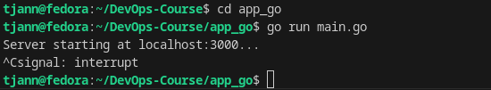
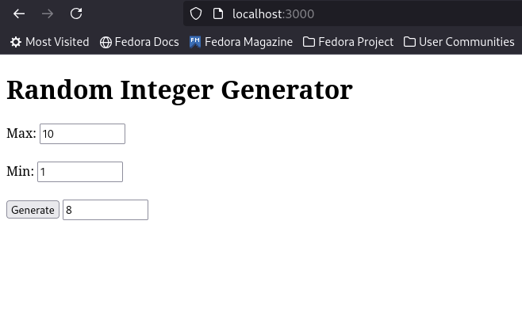
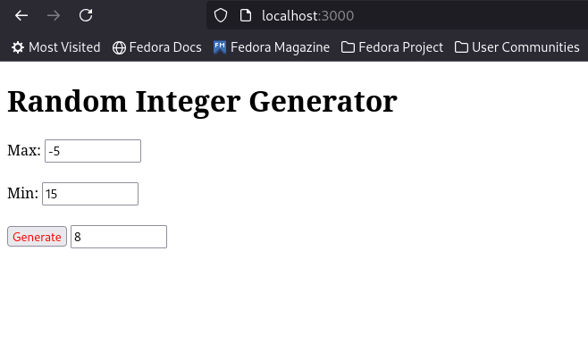

## Go Randomizer


### Prerequisites

```bash
git clone https://github.com/tjann7/DevOps-Course.git
cd DevOps-Course
```

#### Installing Golang on Fedora ~~sorry for the rest~~

```bash
sudo dnf install golang
```

### Starting the app

In the repository enter application directory and execute main.go file:

```
cd app_go
go run main.go
```

In case of a success the terminal will output that the server has started(you can always interrupt the process as usual):



The website is by default located on localhost:3000 address.

Only non-negative integers are allowed, and condition $Min < Max$ must hold:



When trying to get the result with conditions unsatisfied, the button will get red:



## Docker

Building the image:
```bash
docker build -t your_image_name .
```

Pulling the image:
```bash
docker pull tjann7/go_random
```

Running the image locally ~~if you don't like parameters, good luck finding container's address~~:
```bash
docker run --network="host" go_random
```

