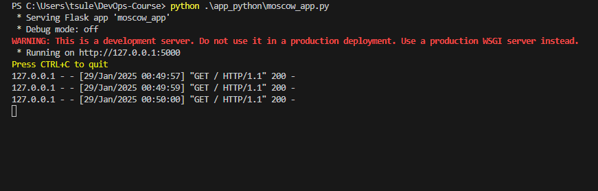
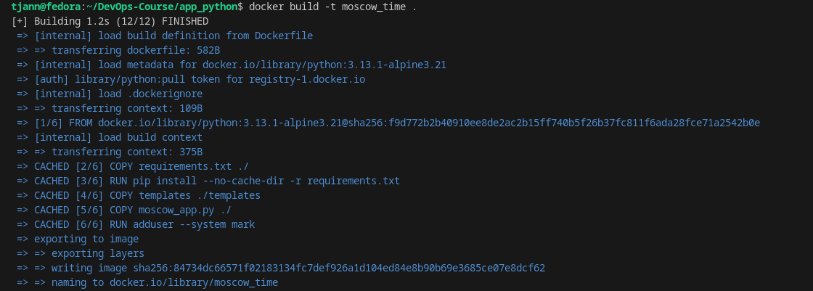
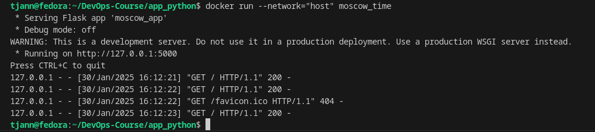

## Python Flask Moscow timezone Watch


## Repository preparation

```bash
git clone https://github.com/tjann7/DevOps-Course.git
cd DevOps-Course
```

## Dependencies installation

```bash
pip install -r requirements.txt
```

## Starting the app
In terminal of the project ('of the project' means being in the project directory) execute bash command:

        python .\app_python\moscow_app.py

A running server should have an output similar to this image:


From which a webapp address can be taken. If a general port is not occupied and no permission issues, the address is always http://localhost:5000

Resulting webpage should look like this:


## Docker

Building the image:
```bash
docker build -t your_image_name .
```

Output should be similar to this:


Pulling the image:
```bash
docker pull tjann7/moscow_time
```

Running the image locally ~~if you don't like parameters, good luck finding container's address~~:
```bash
docker run --network="host" moscow_time
```

Result of running is as follows:



## Running unittest

While being in the repository's directory, input the following commands:

```bash
cd app_python
python -m unittest tests.py
```
This runs a few commands to check that the webapp works properly. In case of successful passing, the result should be similar to this:

```bash
...
----------------------------------------------------------------------
Ran 3 tests in 0.004s

OK
```

## CI Workflow

The workflow is configured to automate the following stages:

* Dependencies - using requerements.txt
* Lint - Checking coding conventions (line length, etc.)
* Snyk - Checks for security vulnerabilities.
* Test - tests.py unittest is called to verify functionality
* Docker - Builds and pushes the Docker image to Docker Hub.

