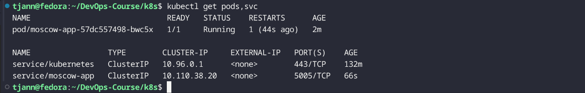
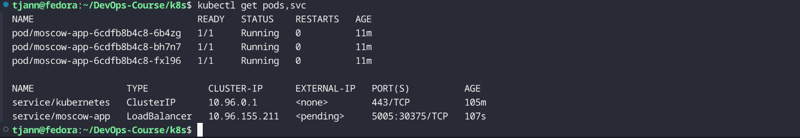
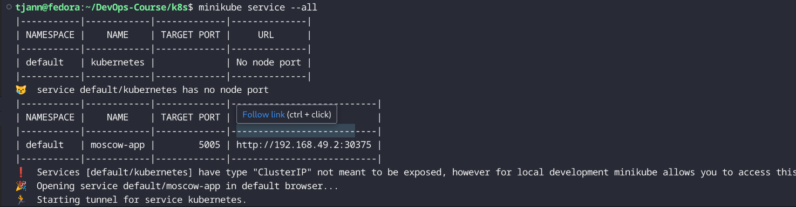
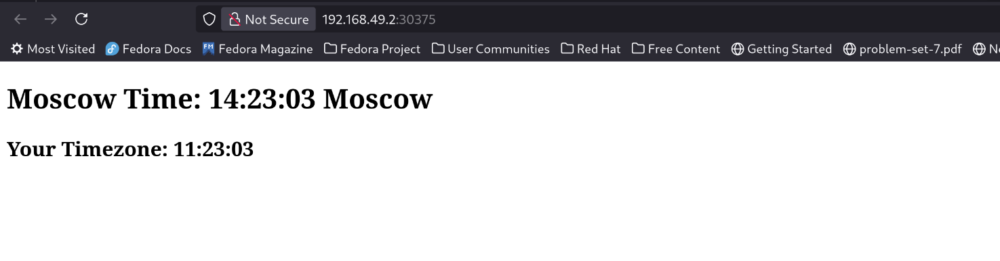

# Task 1

## Command line deployment via image specification:

# Task 2

## Kubectl pods,svc output after deployment

## Minikube Service output

## Webapp ip comparison

## Pods,svc after removal

